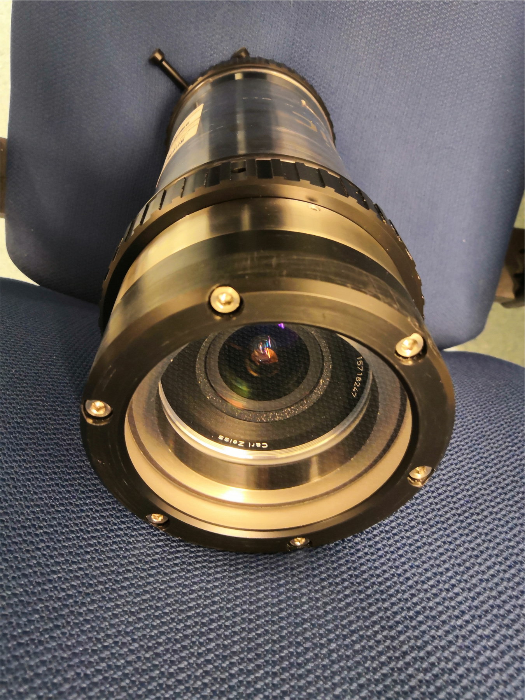

COLMAP Underwater
======

About
-----

This repository is a fork of the original Structure-from-Motion (SfM) framework COLMAP (https://github.com/colmap/colmap), with a primary focus on 3D reconstruction in the underwater domain. It extends COLMAP to support Refractive Structure-from-Motion (RSfM) when utilizing cameras underwater with waterproof housings, including both flat-ports and dome-ports. Additionally, it offers support for integrating navigation data into the reconstruction process, helping to reduce drift in large-scale robotic mapping scenarios.

Features include:
- Implementation of the commonly used refractive camera models (flat-port / dome-port camera models). 
- Refractive Structure-from-Motion.
- Bundle adjustment with pose priors (e.g. navigation data) in SfM to reduce potential drift in the large-scale robotic visual mapping scenario.

Since the main framework is created by the original COLMAP, please also cite the following papers if you use this project for your research:

    @inproceedings{schoenberger2016sfm,
        author={Sch\"{o}nberger, Johannes Lutz and Frahm, Jan-Michael},
        title={Structure-from-Motion Revisited},
        booktitle={Conference on Computer Vision and Pattern Recognition (CVPR)},
        year={2016},
    }

    @inproceedings{schoenberger2016mvs,
        author={Sch\"{o}nberger, Johannes Lutz and Zheng, Enliang and Pollefeys, Marc and Frahm, Jan-Michael},
        title={Pixelwise View Selection for Unstructured Multi-View Stereo},
        booktitle={European Conference on Computer Vision (ECCV)},
        year={2016},
    }

If you use the image retrieval / vocabulary tree engine, please also cite:

    @inproceedings{schoenberger2016vote,
        author={Sch\"{o}nberger, Johannes Lutz and Price, True and Sattler, Torsten and Frahm, Jan-Michael and Pollefeys, Marc},
        title={A Vote-and-Verify Strategy for Fast Spatial Verification in Image Retrieval},
        booktitle={Asian Conference on Computer Vision (ACCV)},
        year={2016},
    }


Compilation
--------

Building COLMAP Underwater from source is exactly the same as building the original COLMAP since there is no extra dependency. Therefore, please see  https://colmap.github.io/install.html.

Why COLMAP Underwater?
---------------

To protect cameras from water and pressure, they are enclosed in waterproof housings, and observe the environment through a transparent window, typically with a *planar* or *spherical* shape. Light rays from the underwater scene change direction when they travel through these interfaces in a non-orthogonal manner, leading to distortion in the acquired images.

A few example underwater cameras are:

<p align="center">
  
   
  
</p>

The planar-shaped housing interfaces are commonly referred to as **flat-ports**, while the spherical-shaped ones are referred to as **dome-ports**.

The housing interfaces are modeled with additional parameters in the image formation process to account for the refraction effects underwater.

- The Flat-port parameters:
  -  the unit-length interface normal vector $(n_x, n_y, n_z)^T$. The normal points towards the positive $Z$-axis, with $(0, 0, 1)^T$ coinciding with the optical axis of the camera.
  - the camera-to-interface distance $d_{\mathrm{int}}$ (the orthogonal distance from the camera projection center to the interface plane) (unit: [$m$]).
  - the thickness of the interface (unit: [$m$]).
  - refraction indices of air, glass and water: $n_a, n_g, n_w$. For example: $n_a = 1.0$, $n_g = 1.49$, $n_w = 1.334$.
  
- The Dome-port parameters:
  -  the dome center in the local camera coordinate frame $\mathbf{C}_d = (c_x, c_y, c_z)^T$ (unit: [$m$]). If $\mathbf{C}_d = (0, 0, 0)^T$, then the dome-port is perfectly centered with the camera, refraction will not occur at the interface.
  - the dome-port radius and thickness (unit: [$m$]).
  - refraction indices of air, glass and water: $n_a, n_g, n_w$.
   
While exact refraction modeling closely resembles physical effects, it invalidates classical pinhole-based multi-view geometry methods like two-view geometry, pose estimation and bundle adjustment. We therefore need to adapt the framework such that these refractive camera models can be utilized in SfM.

What's Different?
---------------

#### Feature Extraction:
<p align="center">
  
</p>

In the *Feature Extraction* step, in addition to providing the intrinsic parameters (**In-air**) of the camera, the refractive parameters can be specified in the **Refractive Camera Model** checkbox.

#### Database:
<p align="center">
  
</p>

The database table is extended to store and display the refractive parameters. If the camera is not refractive, the refractive camera model is set to be *NONE* and the refractive parameters are empty.
**Note**: due to the change in the database table, the database generated by this COLMAP Underwater is **incompatible** with the original COLMAP!

#### Reconstruction Options:

<p align="center">
  
</p>

Setting **enable_refraction** to *true* will activate refractive Structure-from-Motion, otherwise, the framework will perform standard Structure-from-Motion as the original COLMAP regardless of whether the camera is refractive or not.

This **enable_refraction** option also exists in **Feature Matching Widget** and **Bundle Adjustment Widget**.

#### Output format:
Once the reconstruction is finished, the exported *cameras.txt* or *cameras.bin* from COLMAP Underwater contains addtional refractive parameters. Therefore, the format is also **incompatible** with the original COLMAP.

Tips for Refractive SfM
---------------

- **Pre-calibration of the underwater camera systems**. This process involves two key steps:
  - 1) Remove the camera from the underwater housing, if feasible, and calibrate its intrinsic parameters **in-air**.
  - 2) Reassemble the camera with the housing and submerge the entire system underwater alongside a calibration target (e.g., checkerboard, 3D target) to calibrate the refractive parameters (housing calibration). An underwater calibration toolbox is available at: https://cau-git.rz.uni-kiel.de/inf-ag-koeser/calibmar.

- **In the absence of calibration**. If no calibration is available at all, it is still technically possible to refine the intrinsic and refractive parameters during the reconstruction process, given that the initial camera parameters do not significantly deviate. However, it's important to note that this optimization does not guarantee convergence. One approach is to iterate through the dataset multiple times, supplying the reconstruction with the latest best set of parameters until satisfactory convergence is observed.

Using it as a Refractive Vision Library
---------------

#### 1. Create a refractive camera (example as a flat-port camera with random parameters) (example can be found at `src/colmap/tools/example_refrac.cc`).

```C++
#include "colmap/math/random.h"
#include "colmap/scene/camera.h"
#include "colmap/util/logging.h"

#include <iostream>

using namespace colmap;

int main(int argc, char** argv) {
  // Create a traditional in-air camera.

  Camera camera;
  camera.width = 1920;
  camera.height = 1080;
  camera.model_id = CameraModelId::kSimpleRadial;
  std::vector<double> params = {
      1297.3655404279762, 1297.3655404279762, 960.0, 540.0, 0.01};
  camera.params = params;

  // Set the camera as a refractive camera (flat-port case).
  camera.refrac_model_id = CameraRefracModelId::kFlatPort;
  Eigen::Vector3d int_normal;
  int_normal[0] = RandomUniformReal(-0.2, 0.2);
  int_normal[1] = RandomUniformReal(-0.2, 0.2);
  int_normal[2] = RandomUniformReal(0.8, 1.2);
  int_normal.normalize();

  std::vector<double> flatport_params = {int_normal[0],
                                         int_normal[1],
                                         int_normal[2],
                                         colmap::RandomUniformReal(0.001, 0.05),
                                         colmap::RandomUniformReal(0.002, 0.2),
                                         1.0,
                                         1.52,
                                         1.334};
  camera.refrac_params = flatport_params;
```

#### 2. Refractive Back-projection and Projection.
```C++
// Given a random 2D image point, back-project it to 3D as a refracted ray in
  // the water.
  Eigen::Vector2d point2D(
      RandomUniformReal(0.5, static_cast<double>(camera.width - 0.5)),
      RandomUniformReal(0.5, static_cast<double>(camera.height - 0.5)));

  colmap::Ray3D ray_w = camera.CamFromImgRefrac(point2D);
  LOG(INFO) << "ray origin on the interface: " << ray_w.ori.transpose()
            << " , ray direction in the water: " << ray_w.dir.transpose();

  // Find a 3D point on this ray at a random depth.
  const double depth = RandomUniformReal(0.5, 10.0);
  Eigen::Vector3d point3D = ray_w.At(depth);

  // Forward project the 3D point onto the image refractively.
  Eigen::Vector2d projection_refrac = camera.ImgFromCamRefrac(point3D);

  LOG(INFO) << " Original 2D point: " << point2D.transpose();
  LOG(INFO) << "Projected 2D point: " << projection_refrac.transpose();
  return EXIT_SUCCESS;
}
```
``` 
I0304 17:44:58.649542 12573 example_refrac.cc:45] ray origin on the interface: -0.00901437 -0.00256852    0.169886 , ray direction in the water: -0.0534277 -0.0158068   0.998447
I0304 17:44:58.649735 12573 example_refrac.cc:55]  Original 2D point: 571.469 415.248
I0304 17:44:58.649755 12573 example_refrac.cc:56] Projected 2D point: 571.469 415.248
```

#### 3. Refractive Absolute/Relative Pose Estimation.
examples can be found at `src/colmap/tools/eval_refrac_abs_pose.cc` and `src/colmap/tools/eval_refrac_rel_pose.cc`.

License
-------

The COLMAP library is licensed under the new BSD license. Note that this text
refers only to the license for COLMAP itself, independent of its thirdparty
dependencies, which are separately licensed. Building COLMAP with these
dependencies may affect the resulting COLMAP license.

    Copyright (c) 2023, ETH Zurich and UNC Chapel Hill.
    All rights reserved.

    Redistribution and use in source and binary forms, with or without
    modification, are permitted provided that the following conditions are met:

        * Redistributions of source code must retain the above copyright
          notice, this list of conditions and the following disclaimer.

        * Redistributions in binary form must reproduce the above copyright
          notice, this list of conditions and the following disclaimer in the
          documentation and/or other materials provided with the distribution.

        * Neither the name of ETH Zurich and UNC Chapel Hill nor the names of
          its contributors may be used to endorse or promote products derived
          from this software without specific prior written permission.

    THIS SOFTWARE IS PROVIDED BY THE COPYRIGHT HOLDERS AND CONTRIBUTORS "AS IS"
    AND ANY EXPRESS OR IMPLIED WARRANTIES, INCLUDING, BUT NOT LIMITED TO, THE
    IMPLIED WARRANTIES OF MERCHANTABILITY AND FITNESS FOR A PARTICULAR PURPOSE
    ARE DISCLAIMED. IN NO EVENT SHALL THE COPYRIGHT HOLDERS OR CONTRIBUTORS BE
    LIABLE FOR ANY DIRECT, INDIRECT, INCIDENTAL, SPECIAL, EXEMPLARY, OR
    CONSEQUENTIAL DAMAGES (INCLUDING, BUT NOT LIMITED TO, PROCUREMENT OF
    SUBSTITUTE GOODS OR SERVICES; LOSS OF USE, DATA, OR PROFITS; OR BUSINESS
    INTERRUPTION) HOWEVER CAUSED AND ON ANY THEORY OF LIABILITY, WHETHER IN
    CONTRACT, STRICT LIABILITY, OR TORT (INCLUDING NEGLIGENCE OR OTHERWISE)
    ARISING IN ANY WAY OUT OF THE USE OF THIS SOFTWARE, EVEN IF ADVISED OF THE
    POSSIBILITY OF SUCH DAMAGE.

